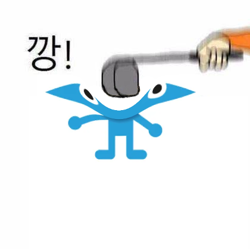
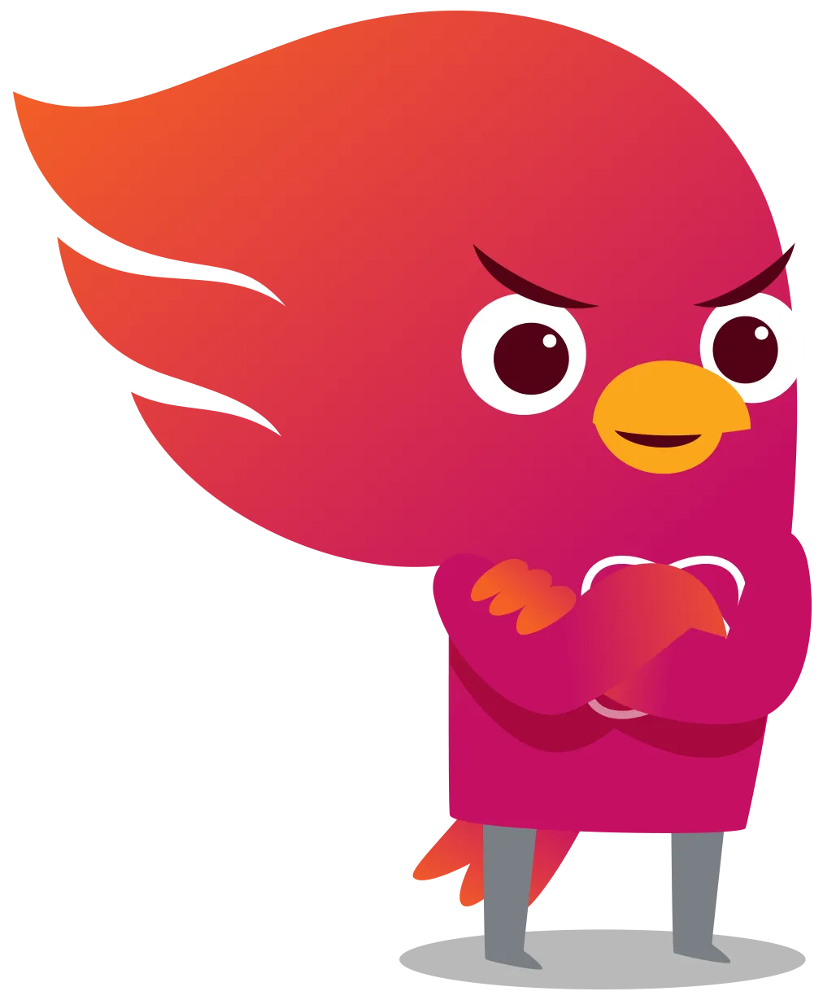
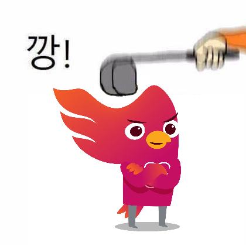

# 깡 생성기 (Kkang Generator) 


## 📸 생성 예시

| 입력 | 출력 |
|------|------|
|  |  |
|  |  |
|  |  |

## 🚀 실행 방법

### Download Model
download models to `./models` folder.
[landmark.pth](https://drive.google.com/open?id=1NckKw7elDjQTllRxttO87WY7cnQwdMqz)
[lbpcascade.xml](https://github.com/nagadomi/lbpcascade_animeface)
[segment.safetensors](https://huggingface.co/skytnt/anime-seg/tree/main)

### Install Requirements
```bash
uv sync
```

### Run the Program
```bash
uv run main.py
```

## 📝 참고 자료

- [anime_face_landmark_detection](https://github.com/kanosawa/anime_face_landmark_detection) - 얼굴 인식 (랜드마크 감지)
- [anime-segmentation](https://github.com/SkyTNT/anime-segmentation) - 이미지 세그멘테이션